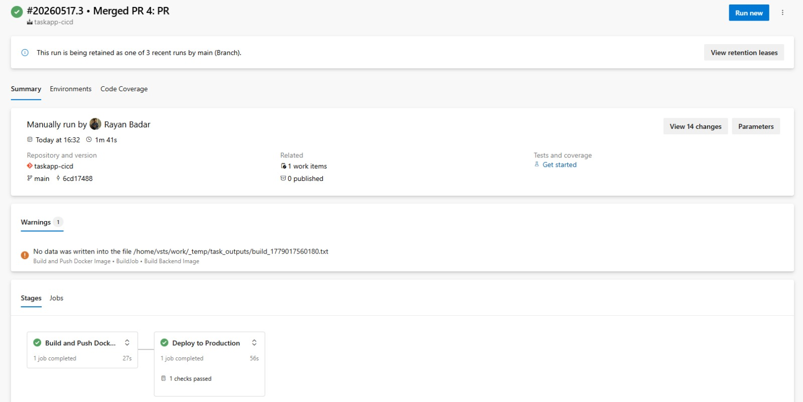
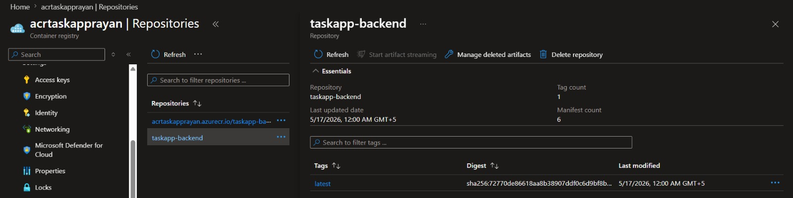
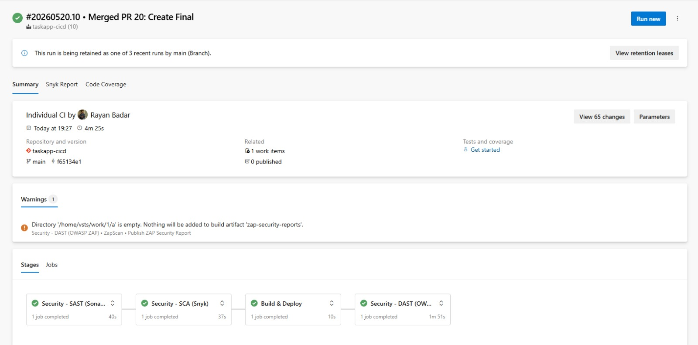

# DevOps Training Lab — Submission

## Live Application URLs

| Resource | URL |
|----------|-----|
| **Frontend (Static Web App)** | [https://icy-pond-03c478a00.7.azurestaticapps.net](https://icy-pond-03c478a00.7.azurestaticapps.net) |
| **Backend API (App Service)** | [https://app-taskapp-backend-rayan-anb7fefwgnfebvc9.centralindia-01.azurewebsites.net/employees](https://app-taskapp-backend-rayan-anb7fefwgnfebvc9.centralindia-01.azurewebsites.net/employees) |

---

## Successful Pipeline Run

---

## Azure Container Registry — Pushed Images

---

## Architecture

| Layer | Technology | Azure Service |
|-------|-----------|---------------|
| Frontend | React.js | Azure Static Web App |
| Backend API | Node.js + Express (Docker) | Azure App Service |
| Database | Azure SQL | Azure SQL Server |
| Container Registry | Docker | Azure Container Registry |
| CI/CD | YAML Pipelines | Azure DevOps |

---

## Git Flow Branches

- `main` — Production-ready code
- `develop` — Integration branch
- `feature/dockerize-app` — Dockerization and pipeline setup

---

## Pipeline Stages

1. **Build** — Builds Docker image and pushes to ACR
2. **Deploy to Production** — Deploys to App Service (with approval gate)

---

# EXTRA MILE

## EM-A: Infrastructure as Code (Terraform)

**Remote State:** Stored in Azure Blob Storage (`sttfstaterayan/tfstate/taskapp.tfstate`)

**Resources Managed by Terraform:**
- Resource Group: `rg-taskapp-tf`
- Azure Container Registry: `acrtaskapprayan`

---

## EM-B: SAST (SonarQube)

**SonarQube URL:** [http://sonarqube-rayan.centralindia.azurecontainer.io:9000](http://sonarqube-rayan.centralindia.azurecontainer.io:9000)

**Hosted on:** Azure Container Instances (serverless)

**Custom Quality Gate:** `taskapp-quality-gate`

**Pipeline Integration:** SAST stage runs before build using SonarScanner CLI

---

## EM-C: SCA (Snyk)

**Snyk Scan Results:** Found 7 issues across 13 vulnerable paths

**Top Vulnerabilities:**
- HIGH: Allocation of Resources Without Limits (qs@6.13.0)
- HIGH: Improper Verification of Cryptographic Signature (jws)
- MEDIUM: Improper Validation of Specified Index (uuid)

---

## EM-D: DAST (OWASP ZAP)

**Target:** `https://icy-pond-03c478a00.7.azurestaticapps.net`

| # | Vulnerability | Severity | Remediation |
|---|--------------|----------|-------------|
| 1 | Missing Content-Security-Policy Header | Medium | Add CSP header via `staticwebapp.config.json` |
| 2 | Missing X-Frame-Options Header | Medium | Add `X-Frame-Options: DENY` |
| 3 | Cookies without Secure Flag | Low | Set `Secure; HttpOnly; SameSite=Strict` |

---

## Full DevSecOps Pipeline

SAST (SonarQube) → SCA (Snyk) → Build & Deploy → DAST (OWASP ZAP)

---

Submitted by: **Rayan Badar**